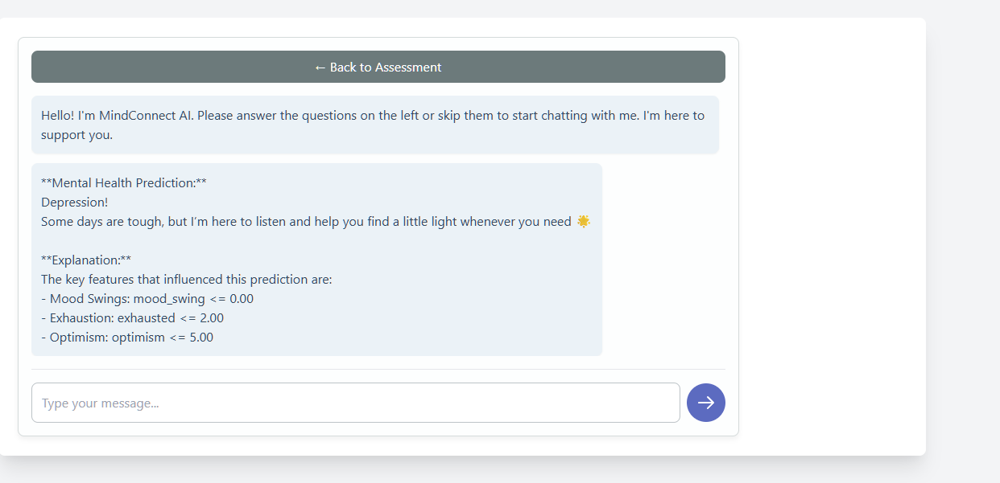

# 🧠 Conversational AI for Mental Disorder Counseling Using Machine Learning

This project integrates **machine learning**, **explainable AI **, and **conversational AI** to build a mental health support system capable of detecting psychological disorders and offering personalized counseling through a chatbot interface.

---

## 🔗 Project Demo





---

## 🧩 Features

- **Mental Health Assessment** based on 10 key psychological indicators.
- **Multimodal Input Interface** (numeric scale, dropdowns, and radio buttons).
- **Machine Learning Classifier** for detecting:
  - Depression
  - Bipolar Type-1
  - Bipolar Type-2
  - Normal Mental State
- **SHAP-based Explainable AI** to highlight which features influenced the model’s decision.
- **Conversational AI Chatbot** powered by Gemini API for empathetic counseling.
- **Frontend built with HTML, CSS, JavaScript**, and **backend with Flask**.
- Deployed locally using `python app.py`.

---

## 🚀 Technologies Used

### 🧠 Machine Learning & Deep Learning
- `Pandas`, `NumPy`, `Seaborn`, `Matplotlib` – Data manipulation & visualization
- `Scikit-learn` – Preprocessing, modeling, and evaluation
- `CatBoostClassifier`, `XGBoostClassifier`, `RandomForest`, `Logistic Regression`, `KNN`, `SVM`
- `TensorFlow / Keras` – Basic ANN for comparison
- `SHAP` – Explainable AI framework

### 💬 Conversational AI
- **Gemini API (Google Generative AI)** – Response generation
- Chatbot activates after the disorder prediction step

### 🌐 Web Development
- **HTML, CSS, JS** – Frontend interface
- **Flask** – Backend logic and API connection
- **Localhost Deployment** using `app.py`

---

## 🧪 Dataset & Features

dataset:- https://www.kaggle.com/datasets/cid007/mental-disorder-classification

| Feature                | Type        | Description                                 |
|------------------------|-------------|---------------------------------------------|
| Mood Swing             | Binary      | Recent mood fluctuation (Yes/No)            |
| Optimism               | Numeric     | Scale from 1 to 10                          |
| Sadness                | Categorical | Frequency (Never, Sometimes, Usually)       |
| Exhaustion             | Categorical | Frequency (Never, Seldom, Often)            |
| Authority Respect      | Binary      | Struggle with authority (Yes/No)            |
| Euphoric               | Categorical | Frequency (Never, Sometimes, Usually)       |
| Suicidal Thoughts      | Binary      | Any suicidal thoughts (Yes/No)              |
| Sleep Disorder         | Categorical | Suffering from sleep issues (Yes/No)        |
| Sexual Activity        | Numeric     | Scale from 1 to 10                          |
| Concentration Level    | Numeric     | Scale from 1 to 10                          |

---

## 🧠 Workflow

### 1. **Data Preprocessing**
- Cleaning & encoding
- Scaling using `StandardScaler`
- Feature engineering via `mutual_info_classif` to reduce columns

### 2. **Model Training**
- Multiple ML models trained
- Best-performing: **CatBoostClassifier** for tabular data

### 3. **Model Evaluation**
- Accuracy Score
- Cross-validation
- Classification Report

### 4. **Explainability**
- SHAP values display key feature contributions for each prediction

### 5. **Web Integration**
- User inputs are submitted via frontend UI
- Backend processes the inputs and returns:
  - Prediction result
  - Key influencing features (using SHAP)
  - Activates counseling chatbot via Gemini API

---

## 🔧 How to Run Locally

1. **Clone the repository:**
   ```bash
   git clone https://github.com/mehedihasanmir/Conversational-AI-For-Mental-Disorder-Counseling-Using-Machine-Learning-Technique-
   cd your-repo
   ```

2. **Install dependencies:**
   ```bash
   pip install -r requirements.txt
   ```

   📄 Or manually create a `requirements.txt` file with the following content:
   ```txt
   numpy
   pandas
   matplotlib
   seaborn
   scikit-learn
   catboost
   xgboost
   tensorflow
   shap
   flask
   ```

3. **Start the Flask server:**
   ```bash
   python app.py
   ```

4. **Visit in your browser:**
   ```
   http://127.0.0.1:5000/
   ```

---

## 🧠 Counseling Chatbot Logic

- Activated **after prediction**
- Uses Gemini API to respond based on prediction
- Provides:
  - Supportive messages
  - Basic advice
  - Encouragement to seek professional help (if needed)
- Includes fallback mode if user skips assessment

---

## 📊 Model Performance

| Model                   | Accuracy (No Feature Selection) | Accuracy (With Feature Selection) |
|-------------------------|-------------------------------|-----------------------------------|
| CatBoost                | 0.9000                        | 0.9000                            |
| K-Nearest Neighbors     | 0.8083                        | 0.8167                            |
| Support Vector Classifier (SVC) | 0.8917              | 0.8667                            |
| XGBoost                 | 0.8333                        | 0.8750                            |
| Random Forest           | 0.8333                        | 0.8250                            |
| Logistic Regression     | 0.8833                        | 0.8250                            |
| Artificial Neural Network | 0.8000                      | 0.8000                            |

---

## 📚 Future Improvements

- Add real-time emotion detection (via camera/microphone)
- Secure user history and data with authentication
- Host the application on a cloud server (e.g., Heroku, AWS, Render)
- Extend chatbot to support voice-based interaction

---

## 👨‍💻 Author

**Mehedi Hasan Mir**    
AI & Data Science Enthusiast  
GitHub: [My-profile](https://github.com/mehedihasanmir)

